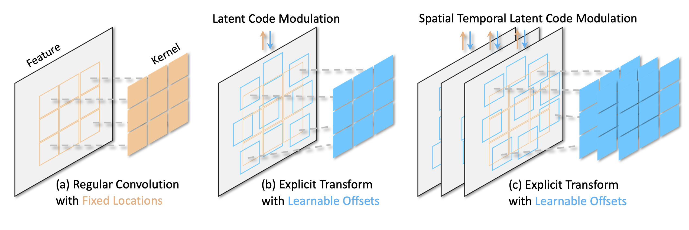

# Learning Modulated Transformation in GANs



> **Learning Modulated Transformation in GANs** <br>
> Ceyuan Yang, Qihang Zhang, Yinghao Xu, Jiapeng Zhu, Yujun Shen, Bo Dai
<br>
> *arXiv preprint arXiv:2308.15472*

[[Paper](https://arxiv.org/pdf/2308.15472.pdf)]


The success of style-based generators largely benefits from style modulation,
which helps take care of the cross-instance variation within data. However, the
instance-wise stochasticity is typically introduced via regular convolution, where
kernels interact with features at some fixed locations, limiting its capacity for
modeling geometric variation. To alleviate this problem, we equip the generator
in generative adversarial networks (GANs) with a plug-and-play module, termed
as modulated transformation module (MTM). This module predicts spatial offsets
under the control of latent codes, based on which the convolution operation can
be applied at variable locations for different instances, and hence offers the model
an additional degree of freedom to handle geometry deformation. Extensive
experiments suggest that our approach can be faithfully generalized to various
generative tasks, including image generation, 3D-aware image synthesis, and
video generation, and get compatible with state-of-the-art frameworks without
any hyper-parameter tuning. It is noteworthy that, towards human generation on
the challenging TaiChi dataset, we improve the FID of StyleGAN3 from 21.36 to
13.60, demonstrating the efficacy of learning modulated geometry transformation.

## TODOs:

- Code is coming soon.

## BibTeX

```bibtex
@article{yang2023learning,
  title   = {Learning Modulated Transformation in GANs},
  author  = {Yang, Ceyuan and Zhang, Qihang and Xu, Yinghao and Zhu, Jiapeng and Shen, Yujun and Dai, Bo},
  article = {arXiv preprint arXiv:2308.15472},
  year    = {2023}
}
```
